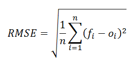

# Datathon 2024

## Overview
The Datathon 2024 competition involved predicting the 'Değerlendirme Puanı' (Evaluation Score) for 11,049 applicants based on various anonymous attributes such as their university, family background, and other personal details. The goal was to build a model capable of accurately predicting these scores using a dataset of previous applications (`train.csv`) and to submit predictions in a specified format.

Participants were tasked with submitting a CSV file containing the `id` and the predicted `Değerlendirme Puani` for each applicant in the test set. The competition was held in multiple stages, with top teams progressing to further rounds and final presentations.

### Timeline
1. **Stage 1**: Kaggle online competition (September 9 - September 15)
2. **Stage 2**: Top 10 teams/best individual participants presented their results to the jury.
3. **Stage 3**: The top 3 teams/individuals were invited to an award ceremony at the BTK Academy during the Data Science Summit.

## Dataset Description
The dataset provided for the competition included two main files:

- `train.csv`: The training set containing the historical data of applicants From 2014 to 2022, including the 'Değerlendirme Puanı' (Evaluation Score).
- `test_x.csv`: The test set containing data for 11,049 applicants from 2023, excluding the 'Değerlendirme Puanı' column.
- `sample_submission.csv`: A sample submission file demonstrating the format for uploading predictions, containing the `id` and the predicted `Değerlendirme Puani`.

### Features
The dataset contains various features that describe applicants' backgrounds, such as:

- **Personal Information**: Gender, birth date, residence city, university, and grade point average.
- **Family Information**: Parents' education level, employment, and sector.
- **Academic Information**: University, department, scholarship status, and other academic details.
- **Extracurricular Activities**: Participation in entrepreneurship clubs, NGOs, professional sports, etc.

The full list of features can be found in the dataset description on Kaggle.
https://www.kaggle.com/competitions/datathon-2024/data

## Evaluation Metric
The performance of the models was evaluated using **Root Mean Squared Error (RMSE)**, a common metric to measure prediction accuracy. RMSE calculates the square root of the average squared differences between predicted and actual values.

**RMSE Formula**:  

The goal was to minimize RMSE, with lower values indicating more accurate predictions.

## Submission Format
The submission file needed to contain two columns:  
- `id`: Corresponding to the applicant ID in the test set.
- `Degerlendirme Puani`: The predicted evaluation score for each applicant.

### The submission file format example:

id,Degerlendirme Puani

0,1.0

1,27.0

2,17.0

## Approach/Methodology
(You can describe your methodology here. Include steps such as data preprocessing, feature engineering, model selection, and hyperparameter tuning.)

## Models Used
- (List the models you used, such as Linear Regression, Random Forest, Gradient Boosting, etc.)
- Briefly describe why you chose these models.

## Results
- **Final RMSE Score**: (Include your final score or range of scores here.)
- Although I did not rank in the top 10, this project provided valuable insights into data preprocessing, model selection, and feature engineering.

## Challenges and Limitations
- **Handling missing data**: Some features had missing values, which required imputation and careful preprocessing.
- **Feature selection**: With many categorical variables, selecting the right features to improve model performance was challenging.
- **Model performance**: While various models were tested, improving RMSE performance required significant tuning and experimentation.

## Conclusion and Next Steps
This project offered a deep dive into handling real-world data, focusing on prediction tasks with large datasets. For future work, I would explore:
- Further optimization of model hyperparameters.
- Trying advanced ensemble methods to improve performance.
- Incorporating feature engineering techniques to enhance model accuracy.

## How to Run the Code
(Provide instructions here for how to run your code locally or in a Kaggle environment. Once you provide the structure of your code, I can help fill this section.)
